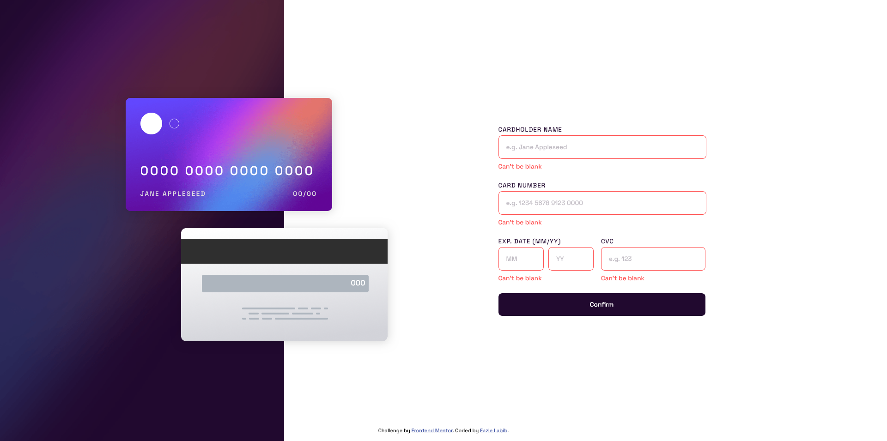

# Frontend Mentor - Interactive card details form solution

This is a solution to the [Interactive card details form challenge on Frontend Mentor](https://www.frontendmentor.io/challenges/interactive-card-details-form-XpS8cKZDWw). Frontend Mentor challenges help you improve your coding skills by building realistic projects. 

## Table of contents

- [Overview](#overview)
  - [The challenge](#the-challenge)
  - [Screenshot](#screenshot)
  - [Links](#links)
- [My process](#my-process)
  - [Built with](#built-with)
  - [What I learned](#what-i-learned)
  - [Continued development](#continued-development)
  - [Useful resources](#useful-resources)
- [Author](#author)

## Overview

### The challenge

Users should be able to:

- Fill in the form and see the card details update in real-time
- Receive error messages when the form is submitted if:
  - Any input field is empty
  - The card number, expiry date, or CVC fields are in the wrong format
- View the optimal layout depending on their device's screen size
- See hover, active, and focus states for interactive elements on the page

### Screenshot





### Links

- Solution URL: [Solution](https://github.com/FazleLabib/frontend-mentor-interactive-card-details-form)
- Live Site URL: [Live Site](https://fazlelabib.github.io/frontend-mentor-interactive-card-details-form)

## My process

### Built with

- Semantic HTML5 markup
- CSS custom properties
- Flexbox
- Mobile-first workflow
- Vanilla JavaScript

### What I learned

Learned a lot about DOM properties of JavaScript. Learned how to add gradient borders. 

To see how you can add code snippets, see below:

<!-- ```html
<h1>Some HTML code I'm proud of</h1>
``` -->
```css
input[type = "text"]:focus, input[type = "text"]:active, input[type = "text"]:hover {
    outline: none;
    border: 1px solid transparent;
    background-image: linear-gradient(var(--white), var(--white)), 
                      linear-gradient(to right, var(--linear-gradient-from), var(--linear-gradient-to));
    background-origin: border-box;
    background-clip: padding-box, border-box;
}
```
<!-- ```js
const proudOfThisFunc = () => {
  console.log('🎉')
}
``` -->

### Continued development

Not happy with the responsiveness of the website right now. Had a hard time properly placing the contents of the card as well as the maintaining proper size of the cards for different screen sizes. I Will try to improve that.

### Useful resources

- [Gradient Borders](https://stackoverflow.com/questions/33054514/how-to-apply-linear-gradient-to-input-border) - I followed this to add the gradient borders in the input field.

## Author

- Frontend Mentor - [FazleLabib](https://www.frontendmentor.io/profile/FazleLabib)
